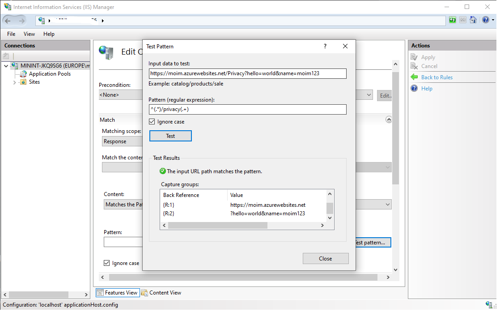

# Outbound URI rewrite with IIS 
An example repo that shows how to rewrite IIS URL (outbound) to configure legacy asp.net web apps hosted on Azure App Service but safeguarded with a WAF (Front-door/Application Gateway)

## Sample ```Web.config```
The changes in ```web.config``` looks like following:

```
      <!- Creating Rewrite rules -->
      <rewrite>
        <outboundRules>          
          <!-- The below rule captures a 302 (redirect) response with 'Location' response header contains an outbound URL (coming from the web app) 
               that has 'signin-oidc' in the path.  When there are 'signin-oidc' present into the path, it will match the regular expression
               and rewrite the Location header with the hostname that comes from your front-door/application gateway URL. The notion {R:2} preserves any following
               query parameters or sub path that was present in the original URL -->
          <rule name="changeURI" enabled="true">
            <match serverVariable="RESPONSE_Location" pattern="^(.*)/signin-oidc(.+)" ignoreCase="true" />
            <action type="Rewrite" value="https://my-waf.azureafd.net/signin-oidc{R:2}" />
          </rule>          
        </outboundRules>
      </rewrite>      
```

## Explanation
The above rule captures a 302 (redirect) response with ```Location``` response header contains an outbound URL (coming from the web app) that has ```signin-oidc``` in the path.  When there are ```signin-oidc``` present into the path, it will match the regular expression and rewrite the ```Location``` header with the ```hostname``` that comes from your front-door/application gateway URL (i.e. https://my-waf.azurefd.net). The notion ```{R:2}``` preserves any following ```query parameters``` or ```sub path``` that was present in the original URL.

In order to understand the ```{R:2}``` syntax in depth, please read the [back-references](https://docs.microsoft.com/en-us/iis/extensions/url-rewrite-module/url-rewrite-module-configuration-reference#using-back-references-in-rewrite-rules) in Microsoft documentation.

The important bit from the document is quoted below:

> Usage of back-references is the same regardless of which pattern syntax was used to capture them. Back-references can be used in the following locations within rewrite rules:
> - In condition input strings
> - In rule actions, specifically:
>   - _url_ attribute of Rewrite and Redirect action
>   - _statusLine_ and _responseLine_ of a _CustomResponse_ action
> - In a _key_ parameter to the rewrite map

Back-references to condition patterns are identified by {C:N} where N is from 0 to 9. Back-references to rule patterns are identified by {R:N} where N is from 0 to 9. Note that for both types of back-references, {R:0} and {C:0}, will contain the matched string.

For example, in this pattern:
```
^(www\.)(.*)$
```
For the string: ```www.foo.com``` the back-references will be indexed as follows:
```
{C:0} - www.foo.com
{C:1} - www.
{C:2} - foo.com
```

Within a rule action, you can use the back-references to the rule pattern and to the last matched condition of that rule. Within a condition input string, you can use the back-references to the rule pattern and to the previously matched condition.

The following rule example demonstrates how back-references are created and referenced:

```
<rule name="Rewrite subdomain">
 <match url="^(.+)" /> <!-- rule back-reference is captured here -->
 <conditions>
  <add input="{HTTP_HOST}" type="Pattern" pattern="^([^.]+)\.mysite\.com$" /> <!-- condition back-reference is captured here -->
 </conditions>
 <action type="Rewrite" url="{C:1}/{R:1}" /> <!-- rewrite action uses back-references to condition and to rule when rewriting the url -->
</rule>
```

## How to create and test these pattern (with RegEx)?

Check out this (Microsoft Documentation](https://docs.microsoft.com/en-us/iis/extensions/url-rewrite-module/testing-rewrite-rule-patterns) how to use the **Test pattern** tool that comes with IIS installation.



That's about it!

## Go have fun!
